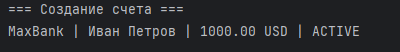
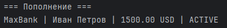
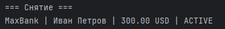
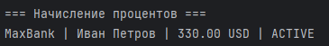
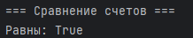
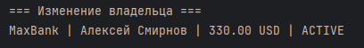
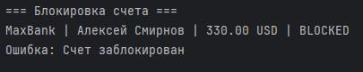
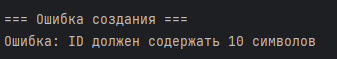
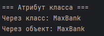

# Лабораторная работа №1

## Класс и инкапсуляция

## Цель работы

В ходе лабораторной работы были изучены:

* создание пользовательских классов
* принципы инкапсуляции
* использование закрытых атрибутов
* работа с `@property`
* переопределение магических методов (`__str__`, `__repr__`, `__eq__`)
* различие между атрибутами класса и экземпляра

## Структура класса

Класс `ClientAccount` содержит:

### Закрытые атрибуты:

* `_id` — номер счета
* `_holder` — владелец
* `_balance` — баланс
* `_currency` — валюта
* `_credit_limit` — кредитный лимит
* `_active` — состояние счета

### Атрибут класса:

* `bank_title = "MaxBank"`

## Валидация данных

Вся логика проверки вынесена в отдельный файл `validate.py`:

* `check_name()` — проверка имени
* `check_id()` — проверка ID
* `check_currency()` — проверка валюты
* `check_money()` — проверка денежных значений

Это позволяет:

* избежать дублирования кода
* упростить поддержку
* улучшить читаемость

### Конструктор

* проверяет корректность входных данных
* учитывает кредитный лимит

### Свойства (@property)

* `holder` (с setter)
* `balance`
* `is_active`

### Бизнес-методы

* `add_funds()` — пополнение счета
* `withdraw_funds()` — снятие средств
* `apply_interest()` — начисление процентов
* `block_account()` — блокировка счета

### Логическое состояние

Счет может быть:

* активным
* заблокированным

При блокировке:

* запрещены операции (пополнение, снятие, проценты)

## Магические методы

* `__str__` — красивый вывод информации о счете
* `__repr__` — строка для восстановления объекта
* `__eq__` — сравнение счетов по ID

## Демонстрация работы

Файл: `demo.py`

### Сценарий 1 — Создание и операции

### Сценарий 2 — Пополнение

### Сценарий 3 — Снятие

### Сценарий 4 — Начисление процентов

### Сценарий 5 — Сравнение объектов

### Сценарий 6 — Изменение через setter

### Сценарий 7 — Блокировка счета

### Сценарий 8 — Ошибка создания объекта

### Сценарий 9 — Атрибут класса

## 📊 Ответы на вопросы

### 1. Что такое класс?

Класс — это шаблон для создания объектов, который описывает их свойства и поведение.

### 2. Что такое инкапсуляция?

Инкапсуляция — это сокрытие внутреннего состояния объекта и доступ к нему только через методы.

### 3. Разница между атрибутами класса и экземпляра?

* Атрибут класса — общий для всех объектов
* Атрибут экземпляра — уникален для каждого объекта

### 4. Что делают @property?

Позволяют управлять доступом к данным (геттеры/сеттеры) как к обычным атрибутам.

### 5. Зачем нужны магические методы?

Они позволяют переопределить стандартное поведение объектов (печать, сравнение и т.д.).