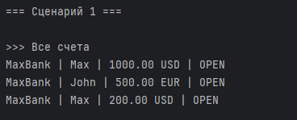
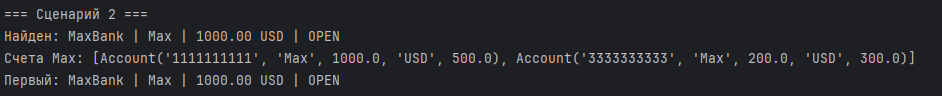
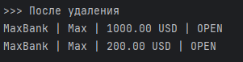
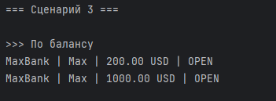
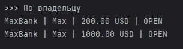
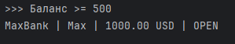
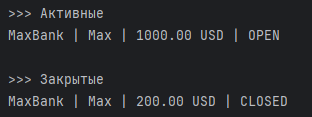
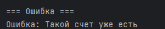

# Лабораторная работа №2

## Коллекция объектов

## Цель работы

В ходе лабораторной работы были изучены:

* работа с коллекциями объектов
* различие между моделью и контейнером
* создание собственного контейнерного класса
* реализация итерации
* управление группой объектов

## Предметная область

Используется предметная область из ЛР-1 — банковские счета.

* модель: `Account`
* контейнер: `AccountStorage`

## Структура проекта

* `model.py`
* `collection.py`
* `demo.py`

## Класс коллекции

Класс `AccountStorage` реализует контейнер для хранения объектов `Account`.

### Внутреннее хранение

* `_data` — список объектов

## Реализованные методы

### Добавление

* `append(account)` — добавление объекта
* проверка типа (`Account`)
* проверка на дубликаты по номеру счета

### Удаление

* `delete(account)` — удаление объекта
* `delete_by_index(index)` — удаление по индексу

### Получение данных

* `all()` — получить список объектов
* `__getitem__()` — доступ по индексу

### Поиск

* `get_by_number()` — поиск по номеру счета
* `get_by_owner()` — поиск по владельцу

### Итерация

* `__iter__()` — перебор коллекции
* `__len__()` — количество элементов

### Сортировка

* `order_by_balance()` — сортировка по балансу
* `order_by_owner()` — сортировка по владельцу
* `sort_accounts(key)` — универсальная сортировка

### Фильтрация

Методы возвращают новую коллекцию:

* `only_active()` — только активные счета
* `only_blocked()` — только закрытые счета
* `with_min_balance(amount)` — счета с балансом не меньше заданного

## Демонстрация работы

Файл: `demo.py`

### Сценарий 1 — Добавление и вывод

### Сценарий 2.1 — Поиск и доступ

### Сценарий 2.2 — Удаление

### Сценарий 3 — Сортировка по балансу

### Сценарий 4 — Фильтрация по владельцу

### Сценарий 5 — Баланс больше числа

### Сценарий 6 — Активные и Закрытые счета

### Сценарий 6 — Обработка ошибки (дубликат)

## Ответы на вопросы

### 1. Что такое контейнер?

Контейнер — это класс, который хранит и управляет группой объектов.

### 2. Разница между моделью и контейнером?

* модель описывает один объект
* контейнер управляет множеством объектов

### 3. Что делает **iter**?

Позволяет перебирать коллекцию с помощью цикла for.

### 4. Что делает **len**?

Позволяет использовать функцию len() для коллекции.

### 5. Что делает **getitem**?

Позволяет обращаться к элементам по индексу.

## Вывод

В ходе работы был реализован контейнер для хранения объектов.

Реализованы:

* добавление и удаление элементов
* проверка типов и защита от дубликатов
* поиск объектов
* сортировка
* фильтрация
* итерация и индексация