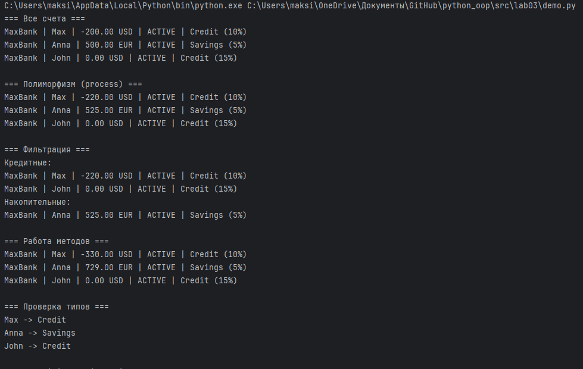

# ЛР-3 — Наследование и иерархия классов

## 1. Цель работы

Изучить механизм наследования в Python, научиться строить иерархию классов, переиспользовать код базового класса, а также реализовать полиморфизм и переопределение методов.

---

## 2. Описание реализованной иерархии классов

### Базовый класс

В качестве базового класса используется `ClientAccount` (из ЛР-1).

Класс описывает банковский счёт и содержит:

* атрибуты:

  * идентификатор счета
  * владелец
  * баланс
  * валюта
  * кредитный лимит
  * статус активности

* основные методы:

  * `add_funds()` — пополнение счета
  * `withdraw_funds()` — снятие средств
  * `apply_interest()` — начисление процентов
  * `block_account()` — блокировка счета
  * `process()` — общий интерфейс для полиморфизма

---

### Дочерние классы

#### 1. CreditAccount

Кредитный счет.

Дополнительно содержит:

* процентную ставку (`_interest_rate`)
* комиссию (`_fee`)

Особенности:

* проценты начисляются только при отрицательном балансе
* при снятии средств добавляется комиссия
* переопределены методы `withdraw_funds()` и `__str__()`

---

#### 2. SavingsAccount

Накопительный счет.

Дополнительно содержит:

* процентную ставку (`_interest_rate`)
* бонус при пополнении (`_bonus`)

Особенности:

* начисляются проценты на положительный баланс
* при пополнении добавляется бонус
* переопределены методы `add_funds()` и `__str__()`

---

### Различия между классами

| Характеристика | CreditAccount            | SavingsAccount       |
| -------------- | ------------------------ | -------------------- |
| Баланс         | может быть отрицательный | только положительный |
| Проценты       | увеличивают долг         | увеличивают баланс   |
| Комиссия       | есть                     | нет                  |
| Бонус          | нет                      | есть                 |

---

## 3. Демонстрация работы

В файле `demo.py` реализованы следующие сценарии:

### 1. Создание объектов

Создаются объекты разных типов:

* кредитные счета
* накопительные счета

---

### 2. Работа с коллекцией

Используется класс `AccountStorage`, который позволяет:

* хранить объекты разных типов
* итерироваться по ним
* выполнять сортировку и фильтрацию

---

### 3. Полиморфизм

Для всех объектов вызывается один и тот же метод:

```python
acc.process()
```

Результат:

* для `CreditAccount` увеличивается долг
* для `SavingsAccount` увеличивается баланс

Это демонстрирует полиморфизм.

---

### 4. Фильтрация

Реализованы методы:

* `only_credit()`
* `only_savings()`
* `only_active()`

Позволяют выбирать объекты по типу и состоянию.

---

### 5. Проверка типов

Используется функция:

```python
isinstance()
```

Для определения типа объекта.

---

### 6. Пример вывода




---

## 4. Вывод

В ходе выполнения лабораторной работы были изучены:

* механизм наследования классов
* построение иерархии объектов
* переопределение методов
* использование `super()`
* полиморфизм
* работа с коллекцией объектов разных типов

Был реализован единый интерфейс (`process()`), который позволяет вызывать одинаковый метод для разных типов объектов без использования условных операторов.
