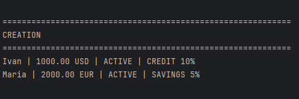
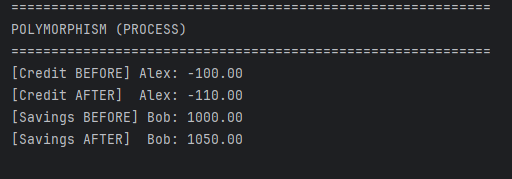
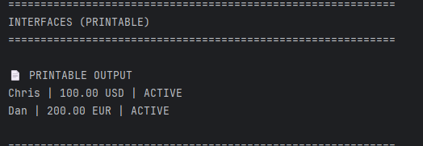
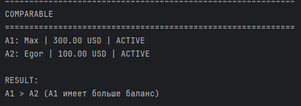

Лабораторная работа №4
Интерфейсы и абстрактные классы (ABC)
1. Цель работы

Цель работы — изучение абстрактных базовых классов (ABC), освоение понятия интерфейса как контракта поведения, закрепление принципов полиморфизма и проектирование архитектуры программной системы на основе интерфейсов.

2. Предметная область

В рамках работы реализована банковская система, включающая различные типы банковских счетов с различным поведением.

3. Реализованные интерфейсы
Интерфейс	Назначение	Абстрактные методы
Printable	Строковое представление объекта	to_string()
Processable	Бизнес-логика обработки счета	process()
Withdrawable	Снятие денежных средств	withdraw_funds(amount)
Comparable	Сравнение объектов	compare_to(other)
4. Описание интерфейсов
4.1 Printable

Интерфейс определяет возможность получения строкового представления объекта.

Метод:

to_string()

Реализуется в классах:

ClientAccount
CreditAccount
SavingsAccount

Назначение: единый формат вывода информации об объектах.

4.2 Processable

Интерфейс определяет бизнес-логику обработки счета.

Метод:

process()

Реализуется в классах:

CreditAccount
SavingsAccount

Особенность: разные реализации метода в зависимости от типа счета (полиморфизм).

4.3 Withdrawable

Интерфейс определяет поведение снятия денежных средств.

Метод:

withdraw_funds(amount)

Реализация:

ClientAccount
CreditAccount

Особенности:

учет кредитного лимита
комиссия в кредитном счете
4.4 Comparable

Интерфейс определяет возможность сравнения объектов.

Метод:

compare_to(other)

Реализуется в классах:

ClientAccount
CreditAccount
SavingsAccount

Сравнение производится по балансу.

5. Реализация классов
5.1 ClientAccount

Базовый класс банковского счета, содержащий:

id счета
владелец
баланс
валюта
кредитный лимит

Реализует базовые интерфейсы системы.

5.2 CreditAccount

Наследник ClientAccount.

Особенности:

начисление процентов на отрицательный баланс
комиссия за снятие средств
переопределение метода process()
5.3 SavingsAccount

Наследник ClientAccount.

Особенности:

начисление процентов на положительный баланс
бонус при пополнении
переопределение process()
6. Полиморфизм

Полиморфизм реализован через единый интерфейс:

acc.process()

Разные классы реализуют метод по-разному:

CreditAccount — обработка задолженности
SavingsAccount — начисление процентов
7. Проверка типов

Используется isinstance для проверки реализации интерфейсов:

isinstance(obj, Printable)

Назначение:

проверка принадлежности к интерфейсу
фильтрация объектов по возможностям
8. Демонстрация работы (demo.py)
Сценарий 1. Создание объектов

Создаются объекты разных типов счетов и демонстрируется их строковое представление.

Результат:

Сценарий 2. Полиморфизм

Вызов метода process() у разных типов объектов без проверки типа.

Результат:

Сценарий 3. Работа через интерфейс Printable

Используется универсальная функция вывода объектов через to_string().

Результат:

Сценарий 4. Сравнение объектов (Comparable)

Используется метод compare_to(), возвращающий:

1 — больше
-1 — меньше
0 — равно
Результат:

9. Вывод

В ходе работы были реализованы абстрактные классы и интерфейсы, обеспечивающие единый контракт поведения для различных типов банковских счетов. Использование полиморфизма позволило унифицировать работу с объектами и повысить расширяемость системы. Архитектура стала более гибкой и независимой от конкретных реализаций классов.