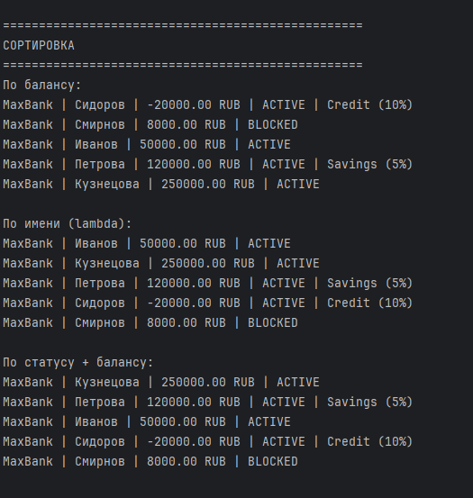
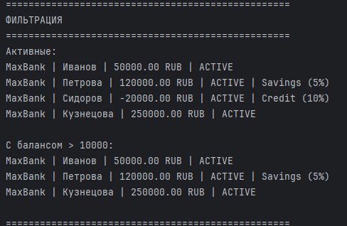
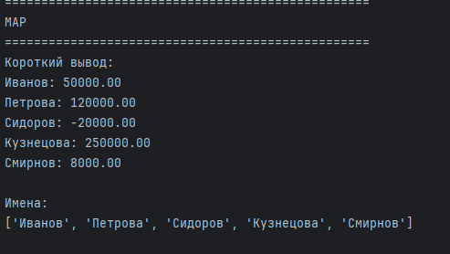
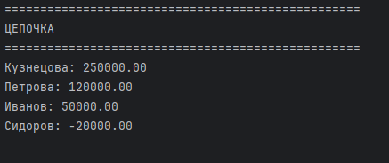
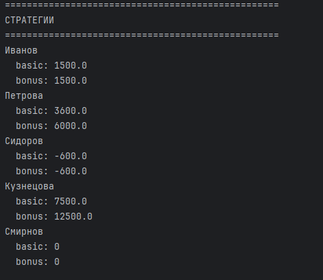

# ЛР-5 — Функции как аргументы. Стратегии

## 1. Цель работы

- Освоить передачу функций как аргументов
- Изучить map, filter, sorted
- Реализовать паттерн «Стратегия»
- Использовать lambda
- Объединить функциональный и ООП подход

---

## 2. Реализация

### Сортировка

| Функция | Описание |
|--------|--------|
| sort_by_balance | по балансу |
| sort_by_holder | по владельцу |
| sort_by_balance_desc | по убыванию |
| sort_by_state_and_balance | статус + баланс |

---

### Фильтры

| Функция | Описание |
|--------|--------|
| account_active | только активные |
| build_balance_filter | фильтр по диапазону |

---

### map / преобразования

| Функция | Описание |
|--------|--------|
| to_short | краткий вывод |
| lambda | извлечение имени |

---

### Фабрики

- build_balance_filter()
- build_interest_applier()

---

### Стратегии

| Класс | Описание |
|------|--------|
| BasicInterest | базовые проценты |
| BonusInterest | бонус при большом балансе |
| NoInterestForRich | без процентов для богатых |

---

### Методы коллекции

| Метод | Описание |
|------|--------|
| sort_by | сортировка |
| filter_by | фильтрация |
| apply | применение функции |

---

## 3. Демонстрация

### Сценарий 1 — Сортировка

Показано:
- sort с key
- lambda
- несколько критериев

---

### Сценарий 2 — Фильтрация

Показано:
- filter()
- фабрика функций

---

### Сценарий 3 — map

Показано:
- преобразование объектов
- извлечение полей

---

### Сценарий 4 — Цепочка

- `images/lab05/4_1.png`  
- `images/lab05/4_2.png`

Показано:
- filter → sort → apply

---

### Сценарий 5 — Стратегии

Показано:
- callable-объекты
- замена стратегии

---

## 4. Вывод

В работе были применены:

- передача функций
- lambda
- map, filter, sorted
- фабрики функций
- паттерн стратегия
- цепочки вызовов
