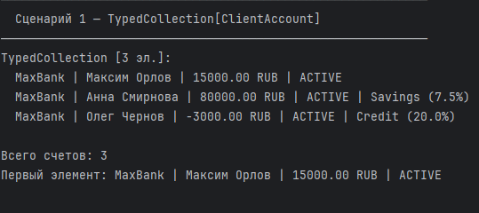
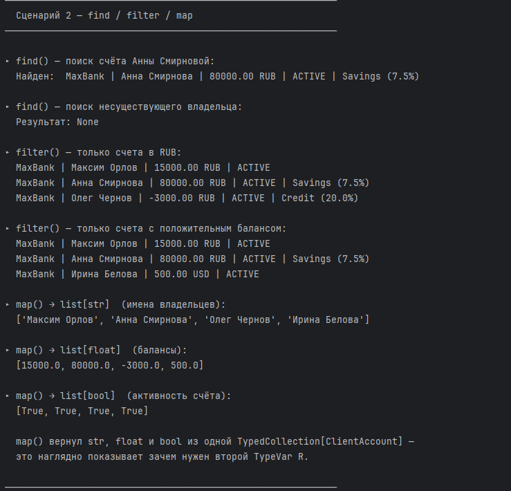
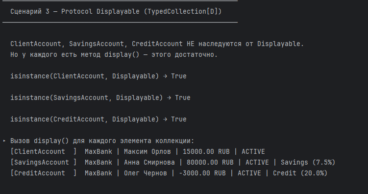
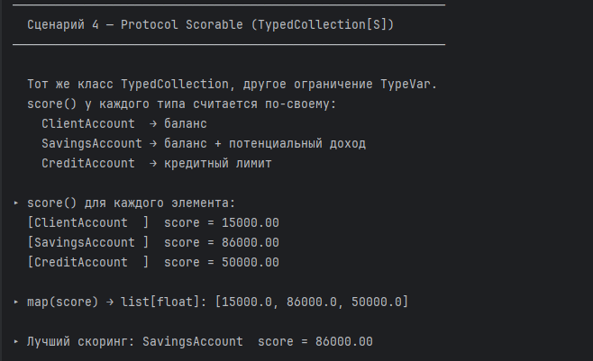

# ЛР-6 — Generics и typing

## Цель работы

Освоить систему аннотаций типов в Python (`typing`).  
Научиться создавать обобщённые классы с помощью `TypeVar` и `Generic`.  
Понять концепцию структурной типизации через `typing.Protocol`.

---

## Описание реализованных типов и контейнеров

### Аннотации типов (задание на 3)

Классы `ClientAccount` (ЛР-1), `CreditAccount` и `SavingsAccount` (ЛР-3)
перенесены в `lab01_typed.py` / `lab03_typed.py` с полными аннотациями:

- параметры конструктора: `acc_id: str`, `balance: float` и т.д.
- возвращаемые значения методов: `def add_funds(self, amount: float) -> None`
- атрибуты в `__init__`: `self._balance: float = float(balance)`

---

### Generic-коллекция TypedCollection (задание на 3–4)

Файл: `container.py`

| TypeVar | Описание |
|---------|----------|
| `T` | произвольный тип элемента коллекции |
| `R` | тип результата метода `map()` — может отличаться от `T` |
| `D` | ограничен протоколом `Displayable` |
| `S` | ограничен протоколом `Scorable` |

Перенесённые методы из `AccountStorage` (ЛР-2):

| Метод | Описание |
|-------|----------|
| `append(item: T)` | добавить элемент |
| `delete(item: T)` | удалить по значению |
| `delete_by_index(idx: int)` | удалить по индексу |
| `all() -> list[T]` | получить все элементы |
| `sort_by(key_func)` | сортировка по ключу |
| `__len__`, `__iter__`, `__getitem__` | протокол последовательности |

Новые функциональные методы (задание на 4):

| Метод | Сигнатура | Описание |
|-------|-----------|----------|
| `find` | `(Callable[[T], bool]) -> Optional[T]` | первый подходящий или None |
| `filter` | `(Callable[[T], bool]) -> list[T]` | все подходящие |
| `map` | `(Callable[[T], R]) -> list[R]` | преобразование с изменением типа |

---

### Протоколы (задание на 5)

```python
class Displayable(Protocol):
    def display(self) -> str: ...

class Scorable(Protocol):
    def score(self) -> float: ...
```

Классы **не наследуются** от протоколов явно — достаточно наличия методов:

| Класс | display() | score() |
|-------|-----------|---------|
| `ClientAccount` |  (возвращает `str(self)`) |  (возвращает баланс) |
| `SavingsAccount` |  (через `super()`) |  (баланс + потенциальный доход) |
| `CreditAccount` |  (через `super()`) |  (кредитный лимит) |

---

## Демонстрация работы

### Сценарий 1 — базовая коллекция

Создание `TypedCollection[ClientAccount]`, добавление трёх счетов разных типов,
вывод коллекции и обращение по индексу.



### Сценарий 2 — find / filter / map

- `find()` — найден счёт Анны Смирновой; поиск несуществующего вернул `None`
- `filter()` — отфильтрованы счета в RUB и с положительным балансом
- `map()` — три вызова с разными функциями вернули `list[str]`, `list[float]`, `list[bool]`



### Сценарий 3 — Protocol Displayable

`TypedCollection[Displayable]` принимает объекты трёх разных классов без наследования
от протокола. `isinstance(..., Displayable)` возвращает `True` благодаря `@runtime_checkable`.
Для каждого объекта вызывается `display()`.



### Сценарий 4 — Protocol Scorable

`TypedCollection[Scorable]` — тот же класс `TypedCollection`, другое ограничение.
`score()` считается по-разному для каждого типа счёта. `map(score)` возвращает
`list[float]`, `find()` находит счёт с наибольшим скорингом.

